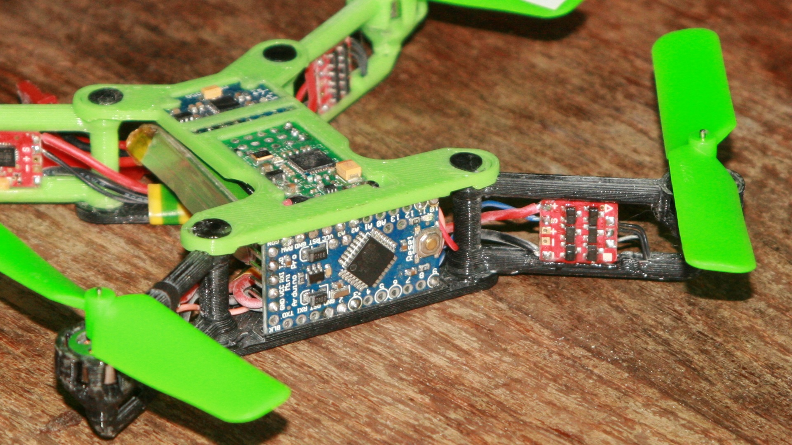
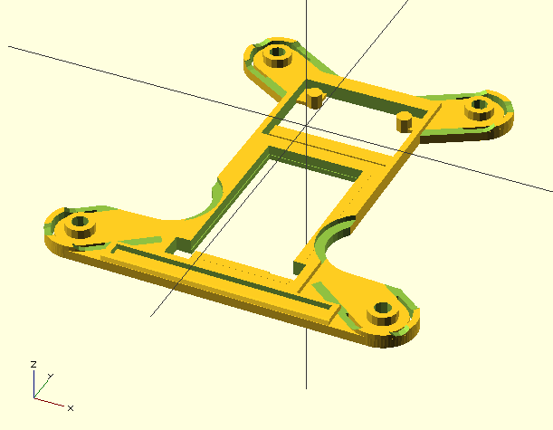
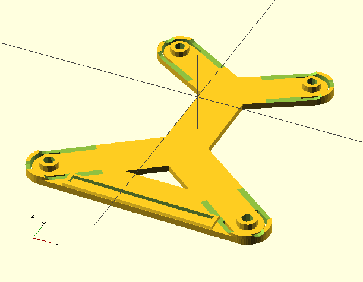
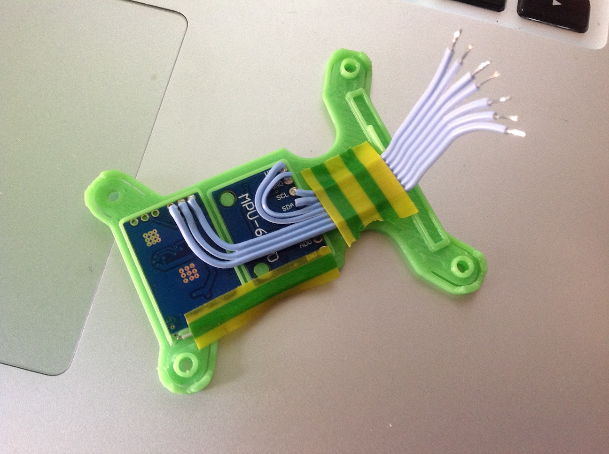

## BOM
* [Arduino uno 3.3V / 8MHz](http://www.amazon.fr/gp/product/B00KMMF4TI?psc=1&redirect=true&ref_=oh_aui_detailpage_o07_s00)
* [MPU6050](http://www.amazon.fr/gp/product/B00E1EQXL6?psc=1&redirect=true&ref_=oh_aui_detailpage_o03_s00)
* [R410X](https://www.hobbyking.com/hobbyking/store/uh_customerShowOrderDetails2.asp?idOrder=20011845025)
* 4 X [Mi-3A](https://www.hobbyking.com/hobbyking/store/__44697__SuperMicro_Systems_Brushless_ESC_3A_Mi_3A.html)
* 4 X [hexTronik 2 gram Brushless Outrunner 7700kv](https://www.hobbyking.com/hobbyking/store/__7230__hexTronik_2_gram_Brushless_Outrunner_7700kv.html)
* 3020 propellers ( [Vl](https://www.hobbyking.com/hobbyking/store/%5F%5F40028%5F%5F3020%5FPropellers%5FGreen%5FL%5FH%5FRotation%5F5Pcs%5FBag%5F.html) [Vr](https://www.hobbyking.com/hobbyking/store/%5F%5F40029%5F%5F3020R%5FPropellers%5FGreen%5FR%5FH%5FRotation%5F5Pcs%5FBag%5F.html) [Or](https://www.hobbyking.com/hobbyking/store/%5F%5F41096%5F%5F3020R%5FPropellers%5FOrange%5FR%5FH%5FRotation%5F5Pcs%5FBag%5F.html) [Ol](https://www.hobbyking.com/hobbyking/store/%5F%5F41095%5F%5F3020%5FPropellers%5FOrange%5FL%5FH%5FRotation%5F5Pcs%5FBag%5F.html) [Br](https://www.hobbyking.com/hobbyking/store/%5F%5F40027%5F%5F3020R%5FPropellers%5FBlack%5FR%5FH%5FRotation%5F5Pcs%5FBag%5F.html) [Bl](https://www.hobbyking.com/hobbyking/store/%5F%5F40026%5F%5F3020%5FPropellers%5FBlack%5FL%5FH%5FRotation%5F5Pcs%5FBag%5F.html) )
* Silicon Wire [Black](https://www.hobbyking.com/hobbyking/store/%5F%5F10936%5F%5FTurnigy%5FPure%5FSilicone%5FWire%5F24AWG%5F1mtr%5FBlack.html) [Red](https://www.hobbyking.com/hobbyking/store/%5F%5F10937%5F%5FTurnigy%5FPure%5FSilicone%5FWire%5F24AWG%5F1mtr%5FRed.html)
* Batteries ( 1S < 20g ) - [300mAh](https://www.hobbyking.com/hobbyking/store/%5F%5F20384%5F%5FTurnigy%5Fnano%5Ftech%5F300mah%5F1S%5F35%5F70C%5FLipo%5FPack%5FFits%5FNine%5FEagles%5FSolo%5FPro%5F100%5F.html) [750mAh](https://www.hobbyking.com/hobbyking/store/%5F%5F20386%5F%5FTurnigy%5Fnano%5Ftech%5F750mah%5F1S%5F35%5F70C%5FLipo%5FPack%5FFits%5FNine%5FEagles%5FSolo%5FPro%5F180%5F.html)

# Calibrating and Printing

## micro_quad_brushless.scad needs 3 files

* constants.scad - printer constants
* components.scad - electronic component mocks
* componentsTest.scad - display and print test stubs for electronics and motors

## Adjust the params to fit your printer and electronic components

0. adjust printer constants
0. adjust electronic component mocks
0. render, export, slice, print and test with componentsTest.scad

## Reposition electronic components
if new size made them out of bound you must edit the copter frame micro_quad_brushless.scad to Reposition them

## Print

The safest order to validate prints is

0. top deck
0. One arm
0. the rest (3 arms and bottom)

## Assemble
Assembly pictures will come

0. use tiny wires for gyro and receiver (I used recylcled ribon), glue them to the frame after soldering 
0. use silicon wires to power the ESC (I used24AWG), power harness is taped to the bottom
0. place arms in closed position
0. use filament and weld it trough the arms

## Flashing Multiwii
You'll need a modified version of multiwii to run at 8Mhz